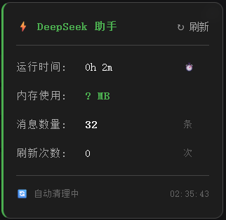
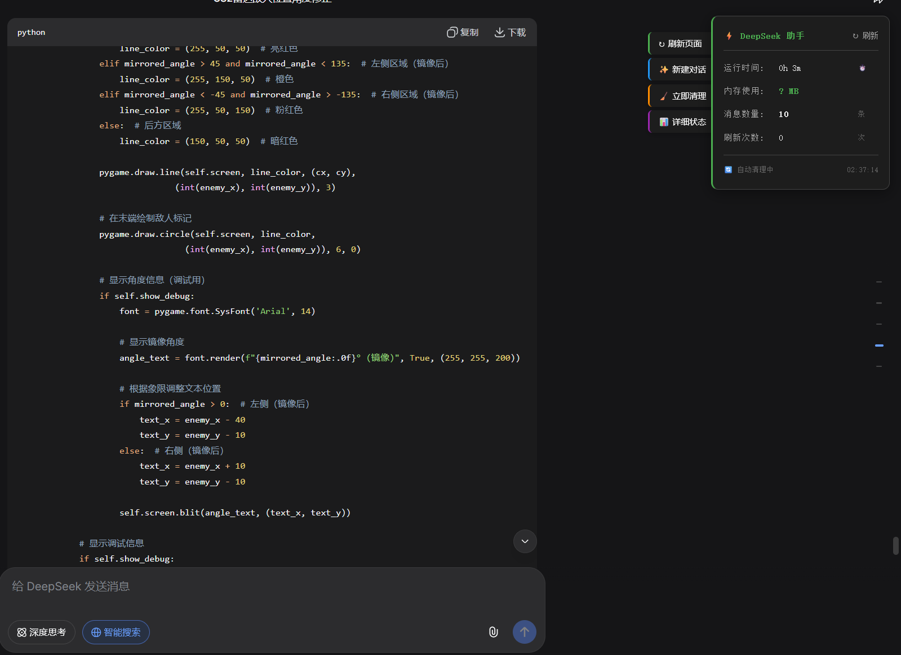

# DeepSeek 轻量级防卡顿助手

## 📖 简介

一个为 DeepSeek 网页版设计的性能优化助手，解决长对话卡顿、内存溢出问题。

## ✨ 功能特点

- 📊 **实时监控**：显示内存使用、运行时间、消息数量
- 🧹 **自动清理**：定期清理离屏元素和Canvas，释放内存
- ⚠️ **智能预警**：内存过高或消息过多时提醒刷新
- 🔄 **快捷操作**：一键刷新、新建对话、手动清理

## 📸 截图

## 🔧 安装方法

1. 安装 [Tampermonkey](https://www.tampermonkey.net/) 浏览器扩展
2. 点击 [这个链接](https://raw.githubusercontent.com/你的用户名/DeepSeek-Performance-Assistant/main/deepseek-performance-assistant.user.js) 安装脚本
3. 访问 [DeepSeek Chat](https://chat.deepseek.com/) 即可使用

## 📋 更新日志

### v2.1 (2024-01-xx)
- 面板默认位置改为右上角
- 优化拖拽体验
- 改进内存监控算法

### v2.0 (2024-01-xx)
- 首次发布

## 📄 许可证

MIT License © 2024 你的名字